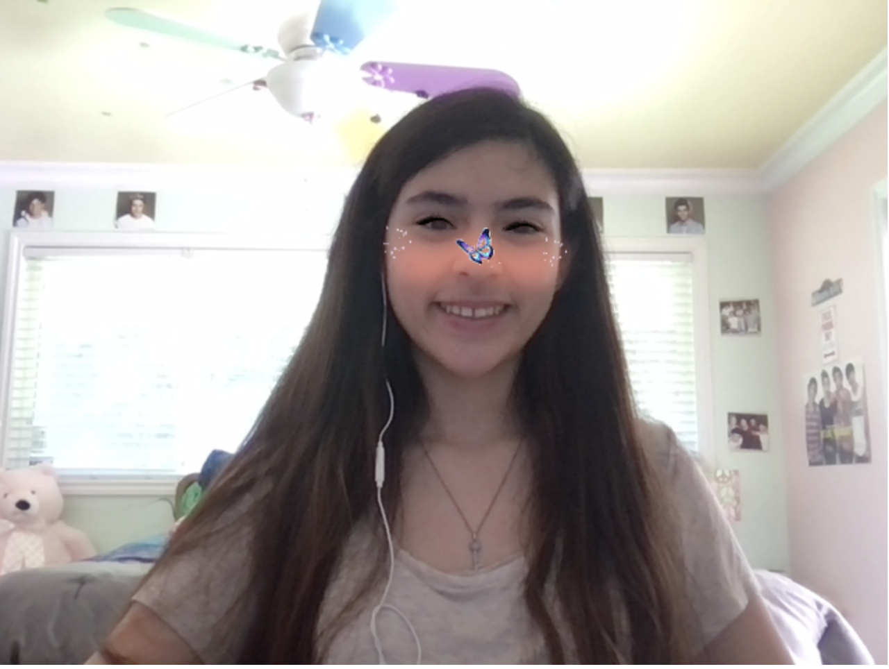

# Project Title:
Butterfly Sparkles

## Description:
This creates a lens that contains some sparkles around the cheeks, as well as a butterfly that flies away when the eyebrows are lifted.

## To Run
Run code locally using `http-server` or the `VSCode Go Live` option.

## Link + Instructions
1. Make sure face is detected and there is good lighting.
2. Once face is detected, raise eyebrows to watch butterfly flutter away.

## Tools Used
p5.js and ml5.js

